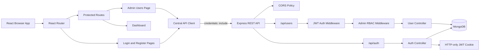
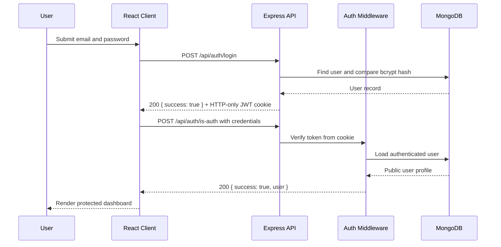
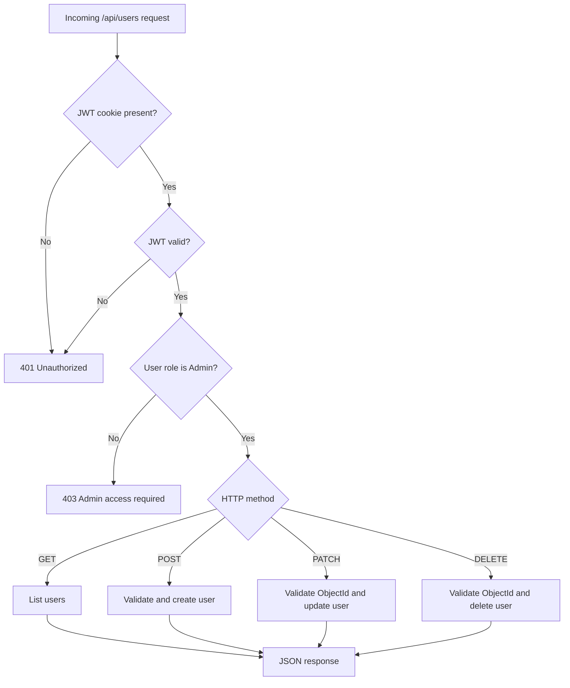
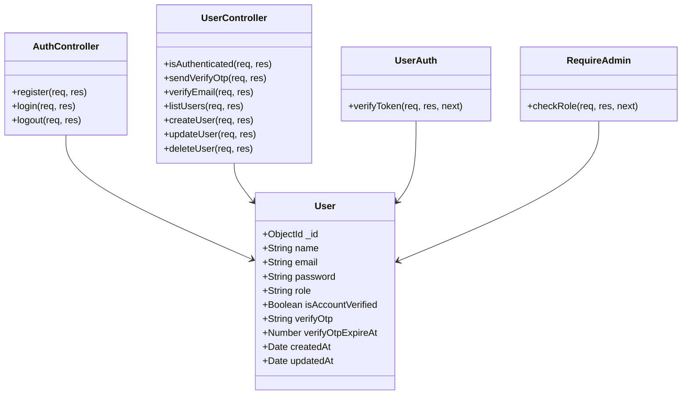

# MERN Auth System

A full-stack authentication and authorization system built with React, Express, MongoDB, and JWT cookies. The project includes a responsive Tailwind CSS frontend, secure server-side authentication, email verification support, and Admin-protected user management.

## Features

- User registration with bcrypt password hashing
- Login and logout using an HTTP-only JWT cookie
- Authenticated session validation with `/api/auth/is-auth`
- Credentialed CORS for local frontend development
- Email verification OTP endpoints
- Role-based access control with `Admin`, `Editor`, and `Viewer` roles
- Admin-only user CRUD API
- Responsive dashboard and users management UI
- Graceful frontend API loading and error states
- Centralized frontend API client
- ESLint and Vite production build support

## Technology

| Layer | Technologies |
| --- | --- |
| Frontend | React 19, Vite, React Router, Tailwind CSS v4, Lucide React |
| Backend | Node.js, Express 5, MongoDB, Mongoose |
| Security | bcryptjs, JWT, HTTP-only cookies, CORS |
| Communication | REST JSON API, cookie credentials |
| Email | Nodemailer |

## Project Structure

```text
MERN Auth system/
├── client/
│   └── authapp/
│       ├── public/
│       ├── src/
│       │   ├── components/       # Shared UI and route guards
│       │   ├── helpers/          # Centralized API client
│       │   ├── hooks/            # Auth and users state
│       │   ├── pages/            # Login, register, dashboard, users
│       │   ├── App.jsx           # Browser routes and providers
│       │   ├── index.css         # Tailwind and theme tokens
│       │   └── main.jsx          # React entry point
│       ├── package.json
│       └── vite.config.js
├── server/
│   ├── config/                   # MongoDB and Nodemailer setup
│   ├── controllers/              # Auth and user business logic
│   ├── middleware/               # Authentication and RBAC guards
│   ├── models/                   # Mongoose models
│   ├── routes/                   # Auth and user route definitions
│   ├── schemas/                  # Mongoose schemas
│   ├── utils/                    # JWT, email, and OTP helpers
│   ├── server.js                 # Express application entry point
│   └── package.json
├── postman/                      # API collections, environments, and specs
├── .gitignore
├── CONTRIBUTING.md
├── LICENSE
└── README.md
```

## Architecture



## Authentication Data Flow



## RBAC User CRUD Flow



## Domain UML



## API Reference

### Authentication

| Method | Endpoint | Access | Purpose |
| --- | --- | --- | --- |
| `POST` | `/api/auth/register` | Public | Create an Admin account and issue a cookie |
| `POST` | `/api/auth/login` | Public | Authenticate a user and issue a cookie |
| `POST` | `/api/auth/logout` | Public | Clear the authentication cookie |
| `POST` | `/api/auth/is-auth` | Authenticated | Return the current public user |
| `POST` | `/api/auth/send-verify-otp` | Authenticated | Send an email verification OTP |
| `POST` | `/api/auth/verify-account` | Authenticated | Verify the account with an OTP |

### User CRUD

Every endpoint below requires a valid JWT cookie and the `Admin` role.

| Method | Endpoint | Purpose |
| --- | --- | --- |
| `GET` | `/api/users` | List users without password fields |
| `POST` | `/api/users` | Create a user with a role |
| `PATCH` | `/api/users/:id` | Update name, email, or role |
| `DELETE` | `/api/users/:id` | Delete a user |

Responses use the shape `{ success: boolean, message?, user?, users? }`.

## Local Setup

### 1. Configure the server

Create `server/.env`:

```env
PORT=4000
MONGODB_URI=mongodb://127.0.0.1:27017/mern-auth
JWT_SECRET=replace-with-a-long-random-secret
CLIENT_URLS=http://localhost:5173,http://127.0.0.1:5173
EMAIL_USER=your-email@example.com
EMAIL_PASS=your-email-password-or-app-password
```

`EMAIL_USER` and `EMAIL_PASS` are required only for email delivery features.

### 2. Install dependencies

```bash
cd server
npm install
cd ../client/authapp
npm install
```

### 3. Start the backend

```bash
cd server
npm run server
```

The API runs at `http://localhost:4000`.

### 4. Start the frontend

In a second terminal:

```bash
cd client/authapp
npm run dev -- --host 127.0.0.1
```

Open `http://127.0.0.1:5173/login`.

### 5. Validate the frontend

```bash
cd client/authapp
npm run lint
npm run build
```

## Important Security Notes

- Do not commit `.env` files or credentials.
- Use a long, unpredictable `JWT_SECRET` outside local development.
- Passwords are never returned by the API.
- RBAC is enforced on the server; hiding frontend buttons is not treated as authorization.
- Use HTTPS and `secure: true` cookies in production.
- Replace the local development CORS origins with deployed frontend origins in production.
- The default password for Admin-created users should be replaced with an invitation or password setup flow before production use.

## Contribution Workflow

1. Create a focused branch from the default branch.
2. Make a small, related change.
3. Run frontend lint/build and relevant server checks.
4. Update the README or API documentation when behavior changes.
5. Open a pull request using the checklist in [CONTRIBUTING.md](CONTRIBUTING.md).

## License

This project is available under the MIT License. See [LICENSE](LICENSE).
